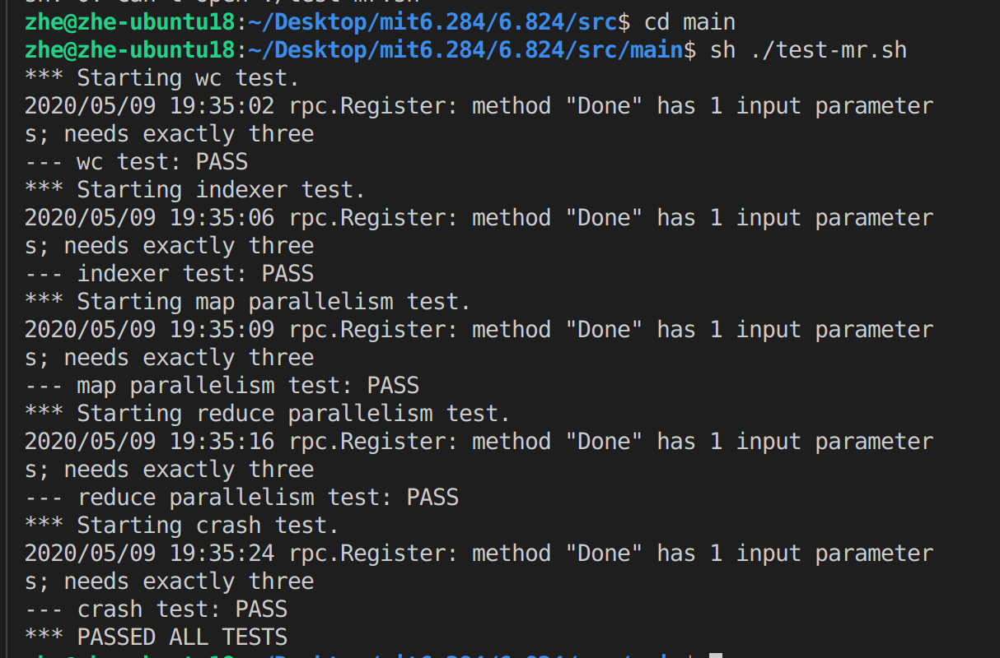
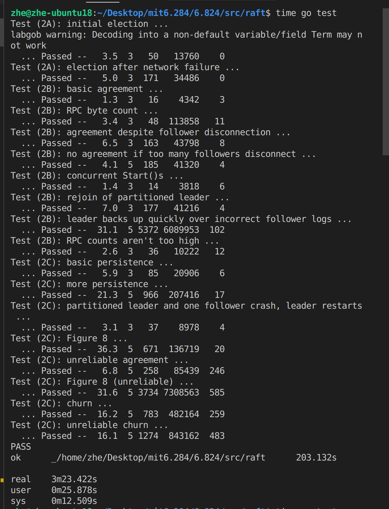

### Learning MIT 6.824 Distributed System and doing labs.

#### Thank MIT for making such a good course available to the public.

#### The code is likely to have bugs and please don't use them directly as solution.

#### Lab Results

###### lab1

###### lab2

